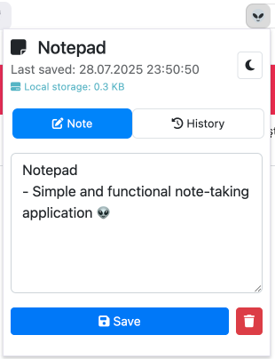
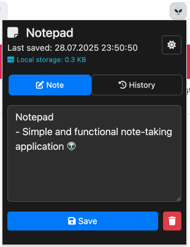
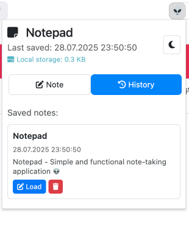
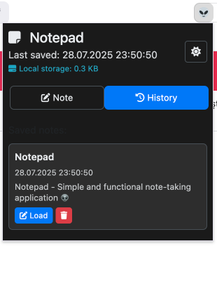

# 📝 Notepad - Ch## 📸 Screenshots

A simple and functional note-taking application with auto-save, theme support, and history management.

## ✨ Features

- ✅ **Auto Save**: Notes are automatically saved as you type
- ✅ **Manual Save**: Save button with timestamp for manual saving
- ✅ **Note History**: View and manage previously saved notes
- ✅ **Note Deletion**: Delete notes with confirmation dialog
- ✅ **Storage Info**: Real-time display of storage usage
- ✅ **Dynamic Titles**: Automatic title generation from note content
- ✅ **Dark/Light Mode**: Toggle between light and dark themes
- ✅ **Responsive Design**: Modern UI with Bootstrap and Font Awesome
- ✅ **Keyboard Shortcuts**: Ctrl+S to save notes
- ✅ **Manifest V3**: Uses Chrome's latest manifest standard

## � Screenshots

Place your screenshots in the `screenshots/` folder:
- `light-mode.png` - Light theme interface
- `dark-mode.png` - Dark theme interface
- `history-tab.png` - History management
- `saving-note.png` - Note saving in action

## 🚀 Installation

### 1. Download Files
Download all files to your computer and place them in a folder.

### 2. Install Extension in Chrome
1. Open Chrome browser
2. Type `chrome://extensions/` in the address bar
3. Enable "Developer mode" in the top right corner
4. Click "Load unpacked" button
5. Select the folder containing the extension files
6. Click "Select Folder" button

### 3. Use the Extension
- Click the extension icon in Chrome toolbar to open the notepad
- Or use the extension from Chrome's extension menu

## 🎯 Usage

### Basic Operations
- **Writing Notes**: Type your notes in the text area
- **Auto Save**: Notes are automatically saved as you type (1 second delay)
- **Manual Save**: Click "Save" button or use `Ctrl+S`
- **Delete Notes**: Click delete button with confirmation dialog

### Tab Navigation
- **Note Tab**: Main editing interface
- **History Tab**: View and manage saved notes history

### History Management
- **View History**: Switch to History tab to see all saved notes
- **Load Note**: Click "Load" button to open a previous note
- **Delete History**: Remove individual history entries
- **Automatic Storage**: Last 10 notes are automatically saved to history

### Theme Switching
- Click the theme button in the top right corner to toggle between dark/light modes
- Theme preference is automatically saved

### Storage Information
- Real-time display of storage usage in KB
- Shows total size of all stored data including notes, history, and settings

### Keyboard Shortcuts
- `Ctrl+S`: Save current note

## 📁 File Structure

```
notepad-extension/
├── manifest.json                    # Extension configuration
├── popup.html                      # Main popup interface
├── popup.css                       # Popup styles
├── popup.js                        # Popup JavaScript code
├── icons/                          # Extension icons
│   ├── icon-16.png                 # 16x16 icon
│   ├── icon-32.png                 # 32x32 icon
│   ├── icon-48.png                 # 48x48 icon
│   └── icon-128.png                # 128x128 icon
├── screenshots/                    # Screenshots folder
│   ├── light-mode.png             # Light theme screenshot
│   ├── dark-mode.png              # Dark theme screenshot
│   ├── history-tab.png            # History tab screenshot
│   └── saving-note.png            # Saving action screenshot
└── README.md                      # This file
```

### Light Theme


### Dark Theme


### History Management


### Save Action


### Additional Screenshots
Place your screenshots in the `screenshots/` folder:
- `light-mode.png` - Light theme interface
- `dark-mode.png` - Dark theme interface
- `history-tab.png` - History management
- `saving-note.png` - Note saving in actiontension

## 🔧 Technical Details

### Manifest V3
- Uses Chrome's latest manifest standard
- Simplified permissions (only storage)
- Modern security standards

### Data Storage
- Notes are stored using `chrome.storage.local`
- Theme preferences are saved persistently
- History is automatically managed (last 10 notes)
- Storage usage is displayed in real-time

### Responsive Design
- Bootstrap 5.3.0 framework
- Font Awesome 6.4.0 icons
- Mobile-friendly interface
- Tab-based navigation

### Storage Structure
```json
{
  "note": "Current note content",
  "lastSaved": "Last save timestamp",
  "theme": "light|dark",
  "noteHistory": [
    {
      "title": "Note title (first line)",
      "date": "Save timestamp",
      "content": "Full note content",
      "preview": "First 100 characters"
    }
  ]
}
```

## 🎨 Customization

### Theme Colors
Edit CSS variables in `popup.css` to customize colors:

```css
:root {
    --primary-color: #007bff;
    --secondary-color: #6c757d;
    --success-color: #28a745;
    --danger-color: #dc3545;
    /* ... other colors */
}

[data-theme="dark"] {
    --primary-color: #0d6efd;
    --body-bg: #1a1a1a;
    --body-color: #e9ecef;
    /* ... dark theme colors */
}
```

### Keyboard Shortcuts
Edit the keyboard event listeners in `popup.js` to modify shortcuts:

```javascript
document.addEventListener('keydown', function(e) {
    if (e.ctrlKey && e.key === 's') {
        e.preventDefault();
        saveNote();
    }
});
```

### History Limit
Change the history limit in `popup.js`:

```javascript
// Add to beginning and limit to 10 items
history.unshift(historyItem);
if (history.length > 10) {  // Change this number
    history.pop();
}
```

## 🐛 Troubleshooting

### Extension Not Loading
- Restart Chrome browser
- Make sure Developer mode is enabled
- Check that all files are in the correct folder
- Verify manifest.json syntax

### Notes Not Saving
- Check Chrome storage permissions
- Clear browser cache
- Remove and reinstall the extension
- Check browser console for errors

### Theme Not Changing
- Check system theme settings
- Restart the extension
- Clear extension storage and try again

### History Not Working
- Ensure storage permissions are granted
- Check that notes are being saved first
- Try clearing extension data and starting fresh

## 📱 Browser Compatibility

- ✅ Chrome (Manifest V3)
- ✅ Chromium-based browsers (Edge, Brave, etc.)
- ❌ Firefox (uses different extension system)
- ❌ Safari (uses different extension system)

## 🔒 Privacy & Security

- All data is stored locally in your browser
- No data is sent to external servers
- No tracking or analytics
- Minimal permissions required (only storage)

## 📝 License

This project is licensed under the MIT License.

## 🤝 Contributing

1. Fork this repository
2. Create a new branch (`git checkout -b feature/new-feature`)
3. Commit your changes (`git commit -am 'Add new feature'`)
4. Push to the branch (`git push origin feature/new-feature`)
5. Create a Pull Request

## 📞 Contact

For questions or suggestions, please open an issue or contact me:

- **GitHub**: [@k0d1r](https://github.com/k0d1r)
- **Project Issues**: [Open an issue](https://github.com/k0d1r/notepad-chrome-extension/issues)

## 👨‍💻 Author

Created with ❤️ by **[@k0d1r](https://github.com/k0d1r)**

<div align="center">
  
[](https://github.com/k0d1r)
[](https://github.com/k0d1r)

</div>

## 🔄 Version History

### v1.0.0
- Initial release
- Basic note-taking functionality
- Auto-save feature
- Theme support
- History management
- Storage information display

---